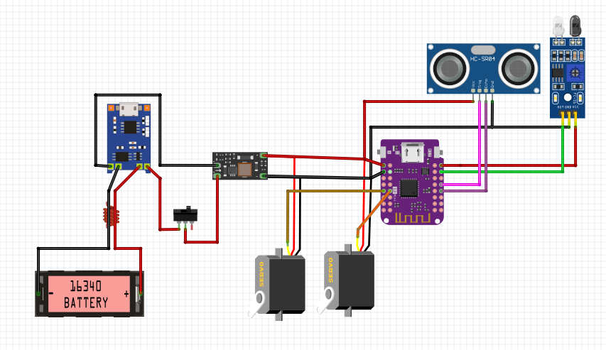

# Build Instructions

A list of the parts needed is found [here.](BOM.md) Files for 3D printed parts are available on [Printables](https://www.printables.com/model/673991-801bot). 

# Part 1: Electronics

Overview of electroncis:

Steps:
1. Prep Battery Connectors
    - Solder `JST-2P Male` connector to `Battery Holder`
    - Solder `JST-2P Female` connector to `TP4056` **Bat+** and **Bat-**
2. Connect Power Circuits
    - Connect `TP4056` **Out+** to `Switch`
    - Connect `5v Boost` **In+** to `Switch`
    - Connect `TP4056` **Out-** to `5v Boost` **In-**
    - Connect `5v Boost` **Out+** to `ESP32` **VBUS**
    - Connect `5v Boost` **Out-** to `ESP32` **GND**
3. Connect Servos
    - Connect both `Servo` **5v**(red) to `ESP32` **VBUS**
    - Connect both `Servo` **GND**(brown) to `ESP32` **GND**
    - Connect Right `Servo` **Signal**(yellow) `ESP32` **33**
    - Connect Left `Servo` **Signal**(yellow) `ESP32` **34**
4. Connect Ultrasonic Sensor
    - Connect `Ultrasonic` **Vcc** to `ESP32` **VBUS**
    - Connect `Ultrasonic` **GND** to `ESP32` **GND**
    - Connect `Ultrasonic` **Echo** to `ESP32` **7**
    - Connect `Ultrasonic` **Trig** to `ESP32` **9**
5. Connect IR Sensor
    - Connect `IR` **VCC** to `ESP32` **VBUS**
    - Connect `IR` **GND** to `ESP32` **GND**
    - Connect `IR` **OUT** to `ESP32` **12**

Signal wires can be connected to different inputs, but that will require editing the program before uploading.

-----

## Step 2: Assembly

1. Place ESP32 and Charging boards into their slots on the floor of the chassis.
2. Place the IR Sensor in the cutouts on the floor of the chassis.
3. Fit the Ultrasonic Sensor in the cutout on the face of the chassis. 
    - The holes in the upper corners will fit over pegs on the alignment blocks.
4. Slot the servos into their mounting holes and screw them in.
    - Use 2 of the screws that came with the servo.
5. Attach the wheels to the servos and screw them in
    - Use the final screw that came with the servo.
6. Connect the battery and fit it in the chassis
7. Slot the Switch into the top plate
8. Screw down the top plate onto the chassis.
