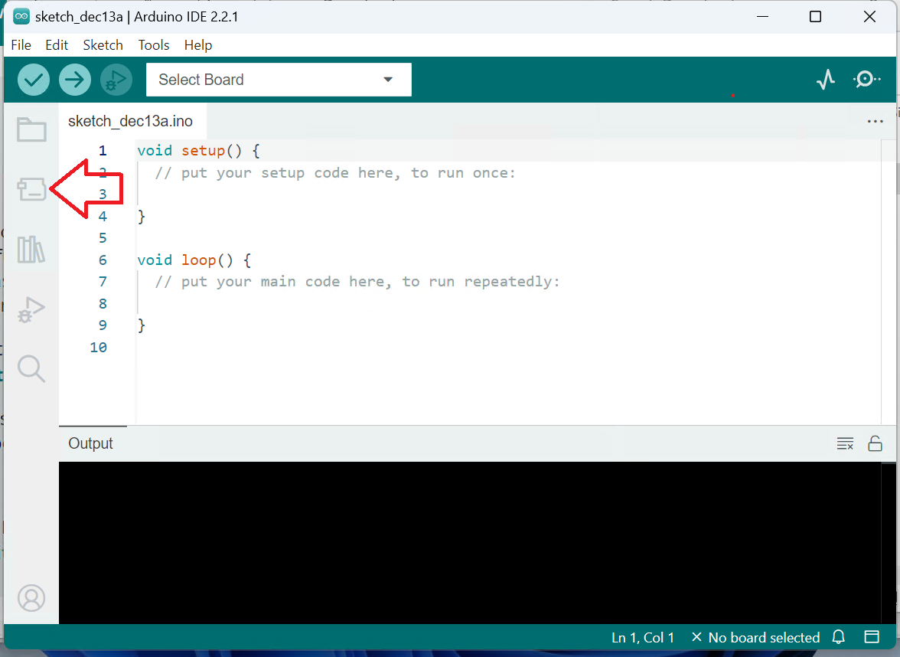
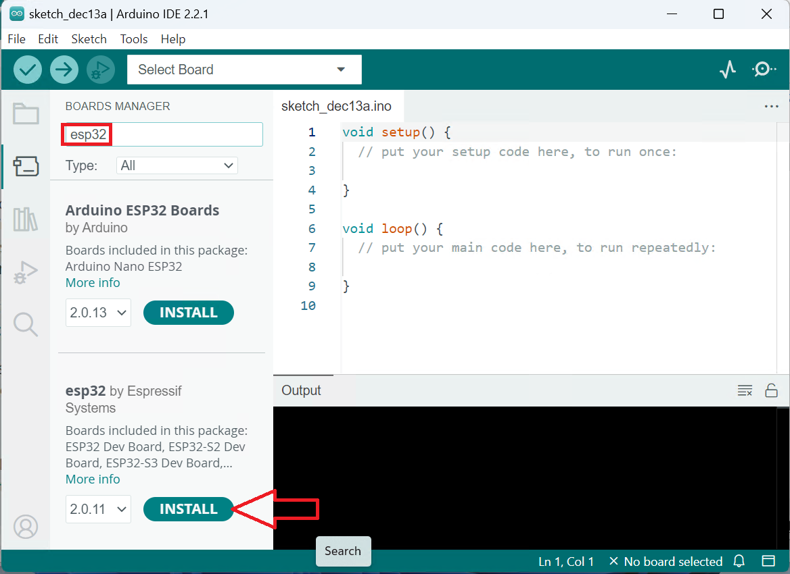
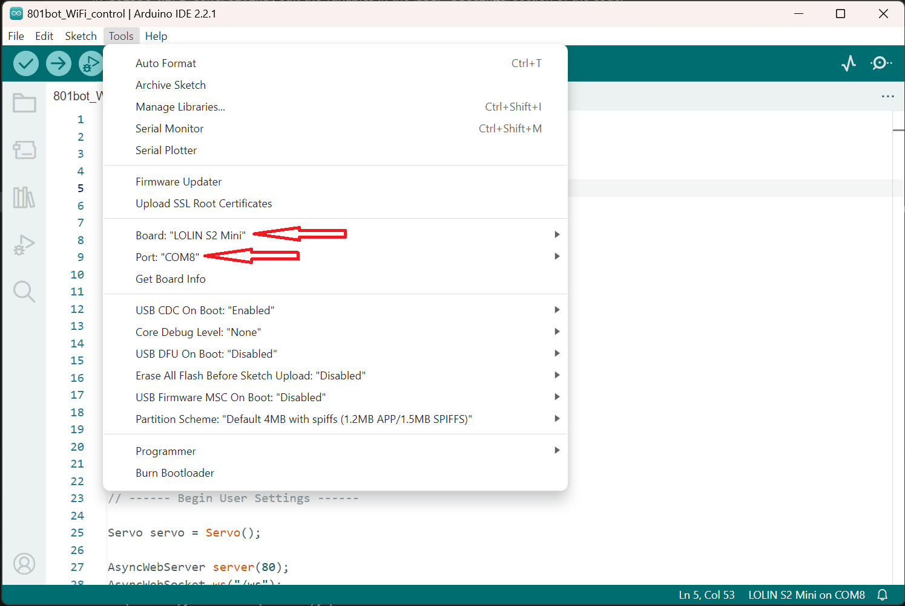

# Programming your 801bot

The code for this project was written using Arduino. The instructions below will help you set up the official Arduino IDE to edit and upload code to the robot. Users familiar with Arduino can use alternatives such as the Arduino plugin for VSCode.

&nbsp;

## Set up Arduino IDE

Download Arduino IDE from the [official website](https://www.arduino.cc/en/software) and install it.

Go to the Boards Manager and install `esp32 by Espressif Systems`.  
 

## Download the code

Download the code from the [Releases page](#) or by cloning the repository.

Unzip the code and open `801bot_WiFi_control.ino` in Arduino IDE.

## Edit the Settings

In `801bot_WiFi_control.ino`, edit the variables in the `User Settings` section of the code. 

The `ssid` and `password` settings should be changed from the default. They set the WiFi name and password of your device.
See the [readme.md](../Code/801bot_WiFi_control/readme.md) file for descriptions of the other settings and if they need to be updated or not.

## Upload the program

Connect the ESP32 in your robot to your computer with a USB-C cable. 

Select the Tools menu from the top bar, and set the Board option to `Lolin S2 Mini` under `Board > esp32 > Lolin S2 Mini`

Also in the Tools menu, set the Port option to the correct port for your board. On Windows, it will be labled something like `COM4`. On Linux or MacOS, it will be labled something like `/dev/ttyACM0`

Click on the upload button, and wait for the process to complete.
